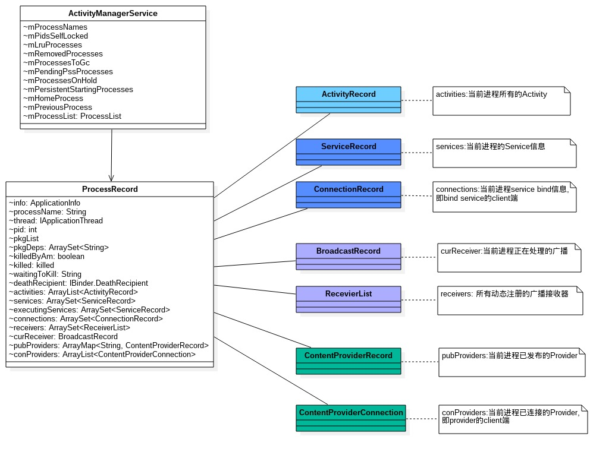
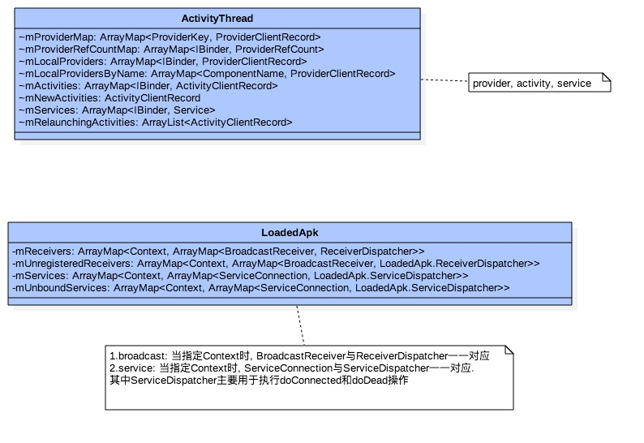

组件启动后，首先需要依赖进程，那么就需要先创建进程，系统需要记录每个进程，这便产生了ProcessRecord。
Android中，对于进程的概念被弱化，通过抽象后的四大组件，让开发者感受不到进程的存在。当应用退出时，进程也并非马上退出，而是
称为cache/empty进程，下次该应用再启动的时候，可以不用创建进程直接初始化组件即可。

# 进程管理

Android系统中用于描述进程的数据结构是ProcessRecord对象，AMS便是管理进程的核心模块。四大组件定义在AndroidManifest.xml文件，每一项都可以
用属性android:process指定所运行的进程。同一个app可以运行在同一个进程，也可以运行在多个进程，甚至多个app可以共享一个进程。

## 进程与AMS的关联
AMS的进程相关的成员变量:
1. mProcessNames:数据类型为ProcessMap，以进程名和userId为Key来记录ProcessRecord：
    * 添加进程，addProcessNameLocked();
    * 删除进程，removeProcessNameLocked();
2. mPidSelfLocked:数据类型为SparseArray，以进程pid为key来记录ProcessRecord：
    * startProcessLocked()，移除已存在进程，增加新创建进程pid信息
    * removeProcessLocked，processStartTimeOutLocked
    * cleanUpApplicationRecordLocked移除进程
3. mLruProcesses：数据类型为ArrayList，以进程最近使用情况来排序记录ProcessRecord:
    * 其中第一个元素代表的便是最近最少使用的进程
    * updateLruProcessLocked()更新进程队列位置
4. mRemovedProcesses：数据类型为ArrayList，记录所有需要强制移除的进程；
5. mProcessesToGc：数据类型为ArrayList，记录系统进入idle状态需执行gc操作的进程；
6. mPendingPssProcesses：数据类型为ArrayList，记录将要收集内存使用数据PSS的进程；
7. mProcessesOnHold：数据类型为ArrayList，记录刚开机过程，系统还没与偶准备就绪的情况下， 所有需要启动的进程都放入到该队列；
8. mPersistentStartingProcesses：数据类型ArrayList，正在启动的persistent进程；
9. mHomeProcess: 记录包含home Activity所在的进程；
10. mPreviousProcess：记录用户上一次刚访问的进程；其中mPreviousProcessVisibleTime记录上一个进程的用户访问时间；
11. mProcessList: 数据类型ProcessList，用于进程管理，Adj常量定义位于该文件；

## 进程与组件的关联
系统这边是由ProcessRecord对象记录进程，进程自身比较重要成员变量如下：
1. processName；记录进程名，默认情况下进程名和该进程运行的第一个apk的包名的相同的，当然也可以自定义进程名
2. pid：记录进程pid，该值由进程创建时内核所分配。
3. thread：执行完attachApplicationLocked()方法，会把客户端进程ApplicationThread的binder服务的代理端传到AMS，并保持到ProcessRecord的成员变量thread
4. info：记录运行在该进程的第一个应用
5. pkgList:记录运行在该进程中所有的包名，比如通过addPackage()添加
6. pkgDeps：记录该进程所依赖的包名，比如通过addPackageDependency()添加
7. lastActivityTime：每次updateLruProcessLocked()过程会更新该值
8. killedByAm：当值为true,意味着该进程是被AMS所杀，并非因为内存低而被LMK所杀
9. killed：当值为true，意味着该进程被杀，不论是AMS还是其他方式
10. waitingToKill：比如cleanUpRemovedTaskLocked()过程会赋值为"remove task"，当该进程处于后台且任一组件都运行在某个进程，再来说说ProcessRecord对象中与组件的关联关系：

|成员变量|说明|对应组件|
|:----:|:------:|:-----:|
|activities|记录进程的ActivityRecord|Activity|
|services|记录进程的ActivityRecord列表|Service|
|executingServices|记录进程的正在执行的ActivityRecord|Service|
|connections|记录该进程bind的ConnectionRecord|Service|
|receivers|动态注册的广播接收者ReceiverList集合|Broadcast|
|curReceiver|当前正在处理的一个广播BroadcastRecord|Broadcast|
|pubProviders|该进程发布的ContentProviderRecord的map表|ContentProvider|
|conProviders|该进程所请求的ContentProviderConnection列表|ContentProvider|

## AMS的组件管理
组件启动，先填充完进程信息，接下来还需要完善组件本身的信息，各个组件在system_server的核心信息记录如下：
* Service的信息记录在ActiveServices和AMS
* Broadcast信息记录在BroasdcastQueue和AMS
* Activity信息记录在ActivityStack，ActivityStackSupervisor，以及AMS
* Provider信息记录在ProviderMap和AMS
AMS是四大组件最为核心：

## APP端的组件信息

主要保存功能：
* ActivityThread：记录provider,activity,service在客户端的相关信息
* LoadedApk：记录动态注册的广播接收器，以及bind方式启动service在客户端的相关信息

