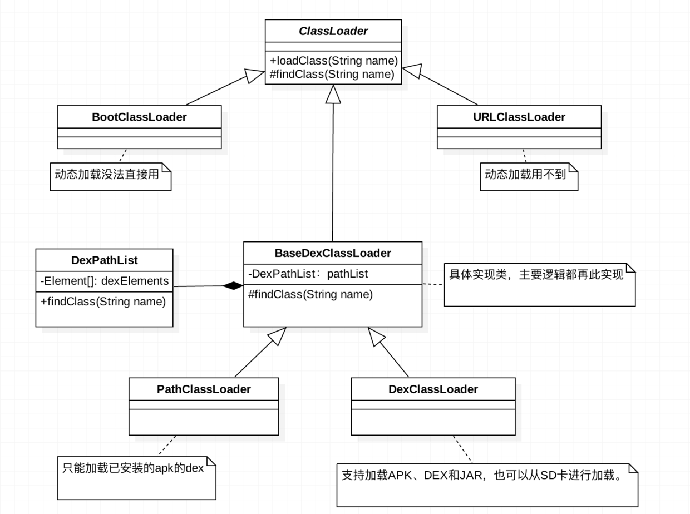

# 类加载
对于Android的应用程序，本质虽然也是用Java开发，并且使用标准的Java编译器编译出Class文件，但最终的APK中包含的却是dex类型。dex文件是将所需的所有Class文件重新打包，打包的规则不是简单的压缩，而是完全对Class文件内部的各种函数表、变量表等进行优化，并产生一个新的文件，这就是dex文件。由于dex文件是一种经过优化的Class文件，因此要加载这样特殊的Class文件就需要特殊的类装载器，这就是DexClassLoader


# 双亲委托
为了更好的保证JAVA平台的安全。在此模型下，当一个装载器被请求加载某个类时，先委托自己的parent去装载，如果parent能装载，则返回这个类对应的Class对象，否则递归委托给父类的父装载。当所有父类装载器都装载失败时，才由当前装载器装载。在此模型下，用户自定义的类装载器，不可能装载应由父类装载的可靠类，从而防止不可靠甚至恶意的代码代替本应该由父亲装载器装载的可靠代码。

ClassLoader#loadClass
```java
protected Class<?> loadClass(String className, boolean resolve) throw ClassNotFoundException {
    Class<?> clazz = findLoadedClass(className);//从已装载过的类中找
    if (c == null) {
        try {
            if (parent != null) {
                c = parent.loadClass(name, false); //由父类装载
            } else {
                c = findBootstrapClassOrNull(name);
            }
        } catch(ClassNotFoundException e) {

        }
        if (c == null) {
            c = findClass(name); //由子类装载
        }
    }
    return c;
}
```

ClassLoder#findLoadedClass
```java
protected final Class<?> findLoadedClass(String name) {
    ClassLoader loader;
    if (this == BootClassLoader.getInstance())
        loader = null;
    else
        loader = this;
    return VMClassLoader.findLoadedClass(loader, name);
}
```


# ClassLoader
Dalvik虚拟机如同其他Java虚拟机一样，在运行程序时首先需要将对应的类加载到内存中。而在Java标准的虚拟机中，类加载可以从class文件中读取，也可以
是其他形式的二进制流。因此，常常利用这一点手动加载Class，从而达到动态加载执行的目的。
只不过Android平台上虚拟机运行的是Dex字节码，一种对class文件优化的产物，传统Class文件是一个Java源码文件会产生一个.class文件，而Android
是把所有Class文件进行合并，优化，然后生成一个最终的class.dex，目的是把不同class文件重复的东西只需保留一份，如果我们的Android不进行分dex处理，
最后一个应用的apk只会有一个dex文件。

# Android平台的ClassLoader


Android中类加载器有BootClassLoader,URLClassLoader,PathClassLoader,DexClassLoader,BaseDexClassLoader，等都是继承自java.lang.ClassLoader

## ClassLoader
java.lang.ClassLoader是所有ClassLoader的最终父类。
主要构造方法：
```java
protected ClassLoader(ClassLoader parent) {
    this(checkCreateClassLoader(), parent);
}
```

```java
protected ClassLoader() {
    this(checkCreateClassLoader()， getSystemClassLoader());
}
```
ClassLoader主要传入一个父构造器，而且一般父构造器不能为空。Android中默认无父构造器为空，默认父构造器为一个PathClassLoader且此PathClassLoader父构造器为BootClassLoader。
ClassLoader中重要的方法是loadClass(String name)，其他的子类都继承了此方法且没有进行复写。

## BootClassLoader
和java虚拟机中不同的是BootClassLoader是ClassLoader内部类，由java代码实现而不是c++实现。是Android平台所有ClassLoader的最终parent

## URLClassLoader
只能用于加载jar文件，但是由于dalvik不能直接识别jar，所以在Android中无法使用这个加载器

## BaseDexClassLoader
PathClassLoader和DexClassLoader都继承自BaseDexClassLoader，其中的主要逻辑都是在BaseDexClassLoader完成的

```java
public BaseDexClassLoader(String dexPath, File optimizedDirectory,
        String librarySearchPath, ClassLoader parent) {
            super(parent);
            this.pathList = new DexPathList(this, dexPath, librarySearchPath, null);
            if (reporter != null) {
                reportClassLoaderChain();
            }
        }
```
BaseDexClassLoader的构造函数包含四个参数，分别为：
1. dexPath，指目标类所在的APK或jar文件的路径，类装载器将从该路径中寻找指定的目标类，该类必须是APK或jar的全路径。如果要包含多个路径，路径之间必须先使用特定的分隔符分隔，特定的分隔符可以使用`System.getProperty("path.separtor")`获得。最终做的是将dexPath路径上的文件ODEX优化到内部位置optimizedDirectory，然后在进行加载。
2. File optimizedDirectory，由于dex文件被包含在APK或者Jar文件中，因此在装载目标类之前需要先从APK或Jar文件中解压出dex文件，该参数就是制定解压出的dex文件存在的路径。这也是对apk中dex根据平台进行ODEX优化的过程。其中APK是一个程序压缩包。里面包含dex文件，ODEX优化就是把包里面的执行程序提取出来，就变成ODEX文件，因为你提取出来了，系统第一次启动的时候就不用去解压程序压缩包的程序，少了一个解压的过程。这样的话系统启动就加快了。

> 为啥第一次？？Because DEX版本也只有第一次会解压执行到/data/dalvik-cache(针对PathClassLoader)或者optimizedDirectory(针对DexClassLoader)目录，之后也是直接读取目录下的dex文件，所以第二次启动就和正常的差不多了。实际上生成的ODEX还有一定优化作用。ClassLoader只能加载内部存储路径的dex文件，所以这个路径必须为内部路径。
3. libPath，指目标类中所使用的C/C++库存放的路径
4. parent，是指该装载器的父装载器，一般为当前执行类的装载器，例如Android中以context.getClassLoader()作为父装载器

## DexClassLoader
```java
public class DexClassLoader extends BaseDexClassLoader {
    public DexClassLoader(String dexPath, String optimizedDirectory, 
    String librarySearchPath, ClassLoader parent) {
        super(dexPath, null, librarySearchPath, parent);
    }
}
```
DexClassLoader支持加载APK、DEX和JAR，也可以从SD卡进行加载。
dalvik不能直接识别jar,DexClassLoader却可以加载jar文件，其实在BaseDexClassLoader里对".jar"，".zip"，".apk",".dex"后缀的文件最后都会生成一个对应的dex文件，所以最终处理的还是dex文件，所以最终处理的还是dex文件

## PathClassLoader
```java
public class PathClassLoader extends BaseDexClassLoader {
    public PathClassLoader(String dexPath, ClassLoader parent) {
        super(dexPath, null, null, parent);
    }

    public PathClassLoader(String dexPath, String librarySearchPath, ClassLoader parent) {
        super(dexPath, null, librarySearchPath, parent);
    }
}
```
PathClassLoader将optimizedDirectory置为Null，也就是没设置优化的存放路径。
optimizedDirectory为null时的默认路径是/data/dalvik-cache目录。
PathClassLoader是用来加载Android系统类和应用的类

## ClassLoader加载class的过程
### BaseDexClassLoader
```java
@Override
protected Class<?> findClass(String name) throws ClassNotFoundException {
    List<Throwable> suppressedExceptions = new ArrayList();
    Class c = pathList.findClass(name, supressedExceptions);
    if (c == null) {
            ClassNotFoundException cnfe = new ClassNotFoundException(
                    "Didn't find class \"" + name + "\" on path: " + pathList);
            for (Throwable t : suppressedExceptions) {
                cnfe.addSuppressed(t);
            }
            throw cnfe;
        }
        return c;
}
```
### DexPathList
```java
public Class<?> findCalss(String name, List<Throwable> suppressed) {
    for (Element element : dexElements) {
        Class<?> clazz = element.findClass(name, definingContext, suppressed);
        if (clazz != null) {
            return clazz;
        }
    }
    if (dexElementsSuppressedExceptions != null) {
        suppressed.addAll(Arrays.asList(dexElementsSuppressedExceptions));
    }
    return null;

}
```

### DexPathList#Element
```java
public Class<?> findClass(String name, ClassLoader definingContext,
    List<Throwable> suppressed) {
        return dexFile != null ? dexFile.loadClassBinaryName(name, definingContext, suppressed): null;
    }
```

### DexFile#loadClassBinaryName
```java
public class loadClassBinaryName(String name, ClassLoader loader, List<Throwable> suppressed) {
    return defineClass(name, loader, mCookie, this, suppressed);
}
```
```java
private static Class defineClass(String name, ClassLoader loader, Object cookie, DexFile dexFile, List<Throwable> suppressed) {
    Class result = null;
    try {
        result = defineClassNative(name, loader, cookie, dexFile);
    } catch (NoClassDefFoundError e) {
        if (suppressed != null) {
            suppressed.add(e);
        }
    } catch (ClassNotFoundException e) {
        if (suppressed != null) {
            suppressed.add(e);
        }
    }
    return result;
}
```
BaseDexClassLoader中有个pathList成员变量，pathList包含了一个DexFile的数组dexElements，dexPath传入的原始dex(.apk，.zip，.jar等)文件在optimizedDirectory文件夹中生成相应的优化的odex文件，dexElements数组就是这些odex文件的集合，如果不分包一般这个数组只有一个Element元素，也就只有一个DexFile文件，而对于类加载呢，就是遍历这个集合，通过DexFile去寻找。最终调用native方法的defineClass。

## ART虚拟机的兼容性问题
Android Runtime，在Android5.0及后续Android版本中作为正式的运行时库取代了以往的Dalvik虚拟机。ART能够把应用程序的字节码转换为机器码，是Android所使用的一种新的虚拟机。它与Dalvik的主要不同在于：Dalvik采用的是JIT技术，字节码都需要通过即时编译器转换为机器码，这会拖慢应用的运行效率，而ART采用Ahead-of-time技术，应用在第一次安装的时候，字节码就会预先编译成机器码，这个过程叫做预编译。ART同时也改善了性能、垃圾回收、应用程序除错以及性能分析。
ART模式相比原来的Dalvik，会在安装APK的时候，使用Android系统自带的dex2oat工具把APK里面的.dex文件优化成OAT文件，OAT文件是一种Android私有ELF文件格式，它不仅包含有从DEX文件翻译而来的文件机器指令，还包含有原来的DEX文件内容。这使得我们无需重新编译原有的APK就可以让它正常在ART里面。
