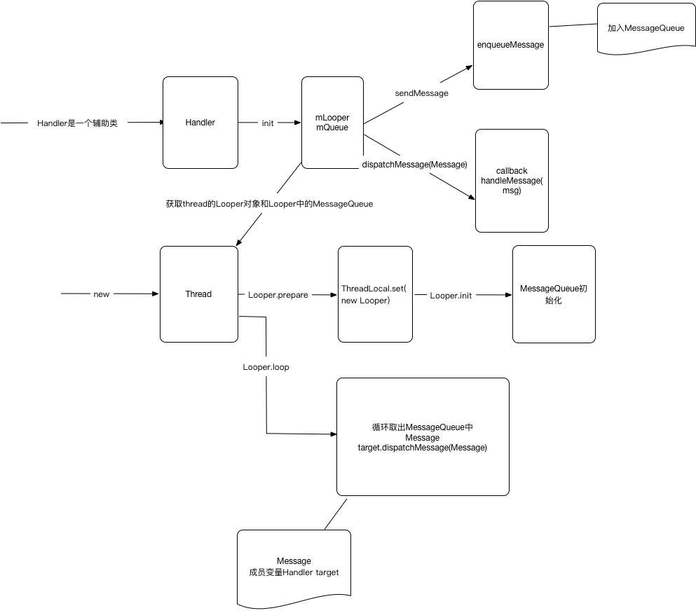

# handler sendMessage()将消息加入message队列

```java
//handler.post()
//调用sendMessageDelayed，最终调用enqueueMessage
public final boolean post(Runnable r) {
    return sendMessageDelayed(getPostMessage(r), 0);
}

//Message.obtain() 利用对象池的方式获得Message 对象, 并且将Runnable 设置为Message对象的callback
private static Message getPostMessage(Runnable r) {
    Message m = Message.obtain();
    m.callback = r;
    return m;
}

//将msg 加入到MessageQueue
private boolean enqueueMessage(MessageQueue queue, Message msg, long uptimeMillis) {
    //msg.target 保持当前handler对象的引用
    msg.target = this;
    if (mAsynchronous) {
        msg.setAsynchronous(true);
    }
    return queue.enqueueMessage(msg, uptimeMillis);
}
```
# looper循环处理消息队列
主线程默认调用如下两个方法。如果在子线程使用handler就要在前后加入这两个方法，这样就会在子线程中轮询
MessageQueue了

## looper.prepare()
创建Looper对象，创建MessageQueue，并且Looper持有MessageQueue的引用，当前线程持有Looper对象引用

```java
private static void prepare(boolean quitAllowed) {
    if (sThreadLocal.get() != null) {
        throw new RuntimeException("Only one Looper may be created per thread");
    }
    //这里把new 出来的Looper对象保存到当前线程中
    sThreadLocal.set(new Looper(quitAllowed));
}

//new Looper() 创建MessageQueue,并且保留当前线程
private Looper(boolean quitAllowed) {
    mQueue = new MessageQueue(quiteAllowed);
    mThread = Thread.currentThread();
}
```

## looper.loop()
遍历MessageQueue，调用handler的dispatchMessage()处理Message

```java
//开始循环处理messageQueue
public static void loop() {
    //首先获取ThreadLocal的Looper对象
    final Looper me = myLooper();
    //获取Looper对象引用的MessageQueue
    final MessageQueue queue = me.mQueue;

    //无限循环
    for(;;) {
        //有消息取，否则阻塞
        Message msg = queue.next();
        if (msg == null) {
            return;
        }

        //调用Message对象引用的handler对象的dispatchMessage()分发消息
        msg.target.dispatchMessage(msg);
    }
}
```

## handler处理Message
如果msg 有callback则先执行msg的callback；
否则执行handler的callback的handleMessage;
否则执行handler子类的handleMessage;

```java
public void dispatchMessage(Message msg) {
    //如果Message的回调不为空，则回调callback
    if (msg.callback != null) {
        handlerCallback(msg);
    } else {
        if (mCallback != null) {
            if (mCallback.handlerMessage(msg)) {
                return;
            }
        }
        //处理Message
        handleMessage(msg);
    }

}
```

主线程默认就有一个Looper对象，在ActivityThread

```java
public static void main(String[] args) {
Looper.prepareMainLooper();

    ActivityThread thread = new ActivityThread();
    thread.attach(false);

    if (sMainThreadHandler == null) {
        sMainThreadHandler = thread.getHandler();
    }

    AsyncTask.init();

    if (false) {
        Looper.myLooper().setMessageLogging(new
                LogPrinter(Log.DEBUG, "ActivityThread"));
    }

    Looper.loop();
}
```
## HandlerThread
主要作用是很简单的创建一个带looper的线程，方便的使用handler的机制做异步处理。
但是他只有一个线程，适合串行任务，不适合做并行任务。比如网络IO阻塞时间比较长，推荐
使用线程池或者asyncTask+线程池来处理。

```java
HandlerThread workerThread = new HandlerThread("workerThread", Process.THREAD_PRIORITY_BACKGROUND);
workerThread.start();
mHandler = new Handler(workerThread.getLooper());
```




# [你知道android的MessageQueue.idleHandler吗？](https://mp.weixin.qq.com/s/KpeBqIEYeOzt_frANoGuSg)


