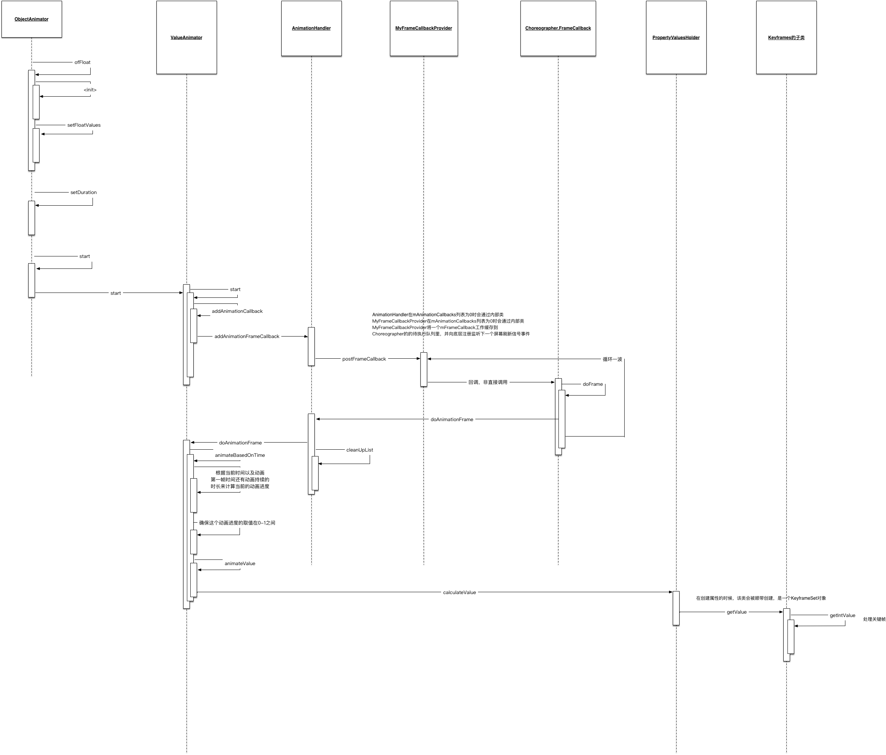

# Android中的动画

动画资源分为两类

- 属性动画

使用`Animator`在设定的一段时间修改对象的属性值来创建动画

- View动画
  - Tween(补间)动画
    通过使用`Animation`在单个图像上执行一系列转换来创建动画
  - Frame(帧)动画
    通过使用`AnimationDrawable`顺序显示一系列图像来创建动画

## 属性动画

在XML中定义的动画，可在一段时间内修改目标对象的属性值，如背景颜色或alpha值


参考文章：
[属性动画 ValueAnimator 运行原理全解析](https://cloud.tencent.com/developer/article/1128091)

属性动画功能非常强大，也是最常用的动画方法。可自定义如下属性：

- 动画时间(Duration)，指定动画总共完成所需要的时间，默认为300ms
- 时间插值器(Time interpolation)，是一个基于当前动画已消耗时间的函数，用来计算属性的值，直接控制动画的变化速率，形象点就是加速度，可以简单理解为变化的快慢
- 重复次数(Repeat count)：指定动画是否重复执行，重复执行的次数，也可以指定动画向反方向地回退操作
- 动画集(Animator sets)，将一系列动画放进一个组，可以设置
- 估值器(TypeEvaluator)：用于计算属性动画的给定属性的取值。与属性的起始值，结束值，fraction三个值相关，控制动画的值

```java
public class AccelerateInterpolator extends BaseInterpolator {
    public float getInterpolation(float input) {
        if (mFactor == 1.0f) {
            return input * input;
        } else {
            //这里第二个参数是第一个参数的幂，所以是指数函数啊
            return (float)Math.pow(input, mDoubleFactor);
        }
    }
}

```

```java
public class IntEvaluator implements TypeEvaluator<Interger> {
    // fraction是插值器转换后的值
    // result = x0 + t * (x1 - x0) 这不就是一次函数吗
    public Integer evaluate(float fraction, Integer startValue, Integer endValue) {
        return (int)(startInt + fraction * (endValue - startInt));
    }
}
```


### ObjectAnimator.ofFloat，是一个静态方法：

- 首先创建ObjectAnimator对象，并指定target对象和属性名
- 然后`setFloatValues(values)`方法，经几次调用，最后调用
    `KeyframeSet.ofFloat(values)`，创建了一个(含多个keyframe)的KeyframeSet对象


```java
public class ObjectAnimator {
    public static ObjectAnimator ofFloat(Object target, String propertyName, float... value) {
        ObjectAnimator anim = new ObjectAnimator(target, propertyName);
        anim.setFloatValues(values);
        return anim;
    }
}
```

### ObjectAnimator.setDuration：

- 该方法用于设置动画的执行总时间，调用父类的ValueAnimator的方法：

### ObjectAnimator.start：

1. ValueAnimator属性动画调用start之后，会先去进行一些初始化工作，包括变量的初始化、通知动画开始事件
2. 通过AnimationHandler将自身this添加到mAnimationCallbacks队列里，AnimationHandler是一个单例，为所有的属性动画服务，列表里存放着所有正在进行或准备开始的属性动画
3. 如果当前存在要运行的动画，那么AnimationHandler会去通过Choreographer向底层注册监听下一个屏幕刷新信号，当接收到信号时，它的mFrameCallback会开始进行工作，工作的内容包括遍历列表来分别处理每个属性动画在当前帧的行为，处理完列表中的所有动画后，如果列表还不为 0，那么它又会通过 Choreographer 再去向底层注册监听下一个屏幕刷新信号事件，如此反复，直至所有的动画都结束。
4. AnimationHandler 遍历列表处理动画是在 doAnimationFrame() 中进行，而具体每个动画的处理逻辑则是在各自，也就是 ValueAnimator 的 doAnimationFrame() 中进行，各个动画如果处理完自身的工作后发现动画已经结束了，那么会将其在列表中的引用赋值为空，AnimationHandler 最后会去将列表中所有为 null 的都移除掉，来清理资源。

.
.
.

### Choreographer类

这是动画最为核心的一个类，动画最后都会走到这个类里面。

见[Choreographer](../choreographer.md)

#### schduleFrameLocked

```java
public class Choreographer {
    public void schduleFrameLocked(long now) {
        if (USE_VSYNC) {
            if (isRunningOnLooperThreadLocked()) {
                schduleVsyncLocked();
            } else {
                Messaage msg = mHandler.obtainMessage(MS_DO_SCHEDULE_VSYNC);
                msg.setAsynchronous(true);
                mHandler.sendMessageAtFrontOfQueue(msg);
            }
        }
    }
}
```

其中USE_VSYNC = SystemProperties.getBoolean("debug.choreographer.vsync", true),该属性值一般都是缺省的，
则USE_VSYNC = true，启动VSYNC垂直同步信号方式来触发动画，当fps=60时候，则1/60=16.7，故VSYNC信号上报的周期为16.7ms；

#### scheduleVsyncLocked

### AnimationHandler

通过Choreographer AnimationHandler获得回调

```java
public class AnimationHandler {
    private final Choreographer.FrameCallback mFrameCallback = new Choreographer.FrameCallback() {
        @Override
        public void doFrame(long frameTimeNanos) {
            doAnimationFrame(getProvider().getFrameTime());
            if (mAnimationCallbacks.size() > 0) {
                getProvider().postFrameCallback(this);
            }
        }
    }

    private void doAnimationFrame(long frameTime) {
        long currentTime = SystemClock.uptimeMillis();
        final int size = mAnimationCallbacks.size();
        for (int i = 0; i < size; i++) {
            final AnimationFrameCallback callback = mAnimationCallbacks.get(i);
            if (callback == null) {
                continue;
            }
            if (isCallbackDue(callback, currentTime)) {
                callback.doAnimationFrame(frameTime);
                if (mCommitCallbacks.contains(callback)) {
                    getProvider().postCommitCallback(new Runnable() {
                        @Override
                        public void run() {
                            commitAnimationFrame(callback, getProvider().getFrameTime());
                        }
                    });
                }
            }
        }
    }
}
```

```java
public class ValueAnimator {
    public final boolean doAnimationFrame(long frameTime) {
        boolean finished = animateBasedOnTime(currentTime);
    }


    boolean animateBaseOnTime(long currentTime) {
        if (mRunning) {
            animateValue(currentIterationFraction);
        }
    }

    void animateValue(float fraction) {
        for (int i = 0; i < numValues; ++i) {
            mValues[i].calculateValue(fraction);
        }
    }
}
```

```java
public class ObjectAnimator {
    void animateValue(float fraction) {
        final Object target = getTarget();
        if (mTarget != null && target == null) {
            cancel();
            return;
        }
        super.animateValue(fraction);
        int numValues = mValues.length;
        for (int i = 0; i < numValues; ++i) {
            mValues[i].setAnimatedValue(target);
        }
    }
}
```

```java
public class PropertyValuesHolder {
    void calculateValue(float fraction) {
        Object value = mKeyframes.getValue(fraction);
        mAnimatedValue = mConverter == null ? value : mConverter.convert(value);
    }

    void setAnimatedValue(Object target) {
        if (mProperty != null) {
            mProperty.set(target, getAnimatedValue());
        }
        if (mSetter != null) {
            try {
                mTemValueArray[0] = getAnimatedValue();
                mSetter.invoke(target, mTmpValueArray);
            }
        }
    }
}
```

## 插值器

插值器是一种的动画修改器，它影响动画中的变化率。 这可以让您现有的动画效果加速，减速，重复，反弹等。
插值器应用于具有android：interpolator属性的动画元素，其值是对插值器资源的引用。
Android中提供的所有插补器都是Interpolator类的子类。 对于每个插值器类，Android都包含一个公共资源，您可以使用android：interpolator属性将插值器应用于动画。

mChoreographer的postCallback方法来启动动画执行的，相当于起了一个定时器来不断更新属性值alpha来实现动画刷新

choreographer这个类是用来控制同步处理输入(Input)、动画(Animation)以及绘制(Draw)三个UI操作的，通过接收显示系统的时间脉冲(垂直同步信号-VSync信号)，在下一个Frame渲染时控制执行这些操作。
