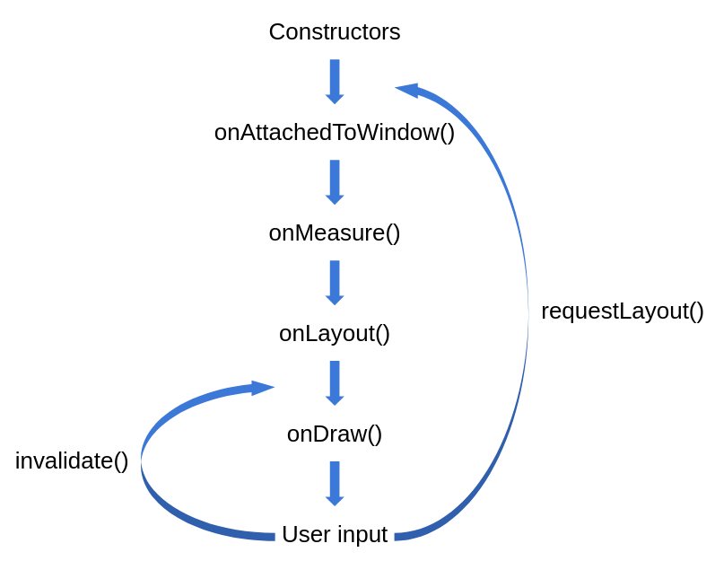
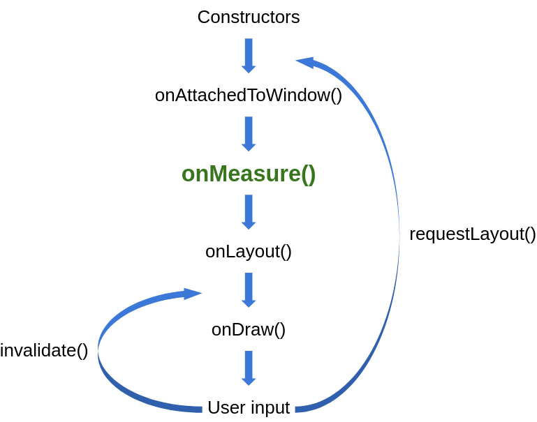

`View`、`Window`以及`Activity`主要用于显示并与用户交互的

# View
这个类表示用户界面组件的基本构建块。一个View在屏幕上占据一个矩形区域，负责绘制和事件处理。
View是widgets的基类，它们是用于创交互式UI组件，
View的子类(ViewGroup)是layout的的基类，它是包含其他Views(或者其他ViewGroups)并定义layout properties

## View的生命周期


## View的构造
```java
public class Indicator extends View {
    public Indicator(Context context) {
        super(context);
        initializeParameters(context, null);
    }

    public Indicator(Context context, AttributeSet atts) {
        super(context, attrs)
        initializeParameters(context, atts);
    }

    public Indicator(Context context, @Nullable AttributeSet attrs, int
    defStyleAttr) {
        super(context, attrs, defStyleAttr);

        initializeParameters(context, attrs);
    }

  @TargetApi(21)
  public Indicator(Context context, @Nullable AttributeSet attrs, int defStyleAttr, int defStyleRes) {
    super(context, attrs, defStyleAttr, defStyleRes);

    initializeParameters(context, attrs);
  }

  private void initializeParameters(Context context, AttributeSet attributes) {

  }
}
```

* 代码方式inflated

* 从XML中inflating

* 在从XML扩展视图并从主题属性应用特定于类的基本样式时创建

* 在从XML扩展视图并从主题属性或样式资源应用特定于类的基本样式时创建。 这个构造函数来自API 21

1. xml>style>Theme中的默认Sytle>默认Style（通过obtainStyledAttributes的第四个参数指定）>在Theme中直接指定属性值
2. defStyleAtrtr即defStyle为0或Theme中没有定义defStyle时defStyleRes才起作用

## Measurements



# Window
顶级窗口外观和行为策略的抽象基类。
an instance of this class should be userd as the top-level view added to window manager。
它提供了标准的UI策略，如背景，标题，区域，默认密钥处理。

这个抽象类的唯一实现是android.view.PhoneWindow。

Window在Android中有三种类型:
- 应用Window： z-index在1~99之间，它往往对应着一个Activity
- 子Window：z-index在1000~1999之间，它往往不能独立存在，需要依附在父Window上，例如Dialog等
- 系统Window：z-index在2000~2999之间，它往往需要声明权限才能创建

> z-index是Android窗口的层级概念，z-index越大的窗口越居于顶层

z-index对应着WindowManager.LayoutParams里的type参数

## 窗口参数
在WindowManager里定义了一个LayoutParams内部类，它描述了窗口的参数信息：


> Window负责管理View， View是Window里面用于交互的Ui元素。Window只attach一个View Tree，当Window需要重新绘制(如，当View调用invalidate)
最终转为window的surface, surface被锁住并返回Canvas对象，此时View拿到Canvas对象来绘制自己。当所有View绘制完成后，Surface解锁，并且post到绘制缓存用于绘制，
通过Surface Flinger来组织各个Window，显示最终的整个屏幕。

在Activity的attach方法中新建了PhoneWindow对象

PhoneWindow的setContentView函数会调用installDecor来创建DecorView对象
```java
public void setContentView(int layoutResId) {
    if (mContentParent == null) {
        installDecor();
    } else if (!hasFeature(FEATURE_CONTENT_TRANSITIONS)) {
        mContentParent.removeAllViews();
    }

    if (hasFeature(FEATURE_CONTENT_TRANSITIONS)) {
        final Scene newScene = Scene.getSceneForLayout(mContentParent, layoutResID,
                    getContext());
            transitionTo(newScene);
    } else {
        mLayoutInflater.inflate(layoutResID, mContentParent);
    }
    mContentParent.requestApplyInsets();
    final Callback cb = getCallback();
    if (cb != null && !isDestoryed()) {
        cb.onContentChanged();
    }
    mContentParentExplicitlySet = true;
}
```

在installDecor函数中调用了generateDecor函数来创建按DecorView对象
```java
private void installDecor() {
    if (mDecor == null) {
        mDecor = generateDecor();
        mDecor.setDescendantFousability(ViewGroup.FOCUS_AFTER_DESCENDANTS);
        mDecor.setIsRootNamespace(true);
    }
}
```
```java
protected DecorView generateDecor() {
    return new DecorVew(getContext, -1);
}
```

# Activity 
an activity is single, focused thing that the user can do.
几乎全部activities与用户交互，所以activity类负责处理创建一个窗口。可以在其中放置UI。

ActivitThread中的performLaunchActivity函数中，先创建了Activity，然后调用了Activity的attach函数

```java
Activity activity = null;
try {
    java.lang.ClassLoader cl = appContext.getClassLoader();
    if (appContext.getApplicationContext() instanceof Application) {
        activity = ((Application) appContext.getApplicationContext())
            .instantiateActivity(cl, component.getClassName(), r.intent);
    }
    if (activity == null) {
        activity = mInstrumentation.newActivity(
            cl, component.getClassName(), r.intent);
    }
    ...

    if (activity != null) {
        activity.attach(...)
    }
}
```

attach函数，先创建了PhoneWindow对象给了mWindow，然后调用其setWindowManager设置其WindowManager，最后调用mWindow的getWindowManager方法作为Activity的mWindowManager成员变量

```java
mWindow = new PhoneWindow(this, window, activityConfigCallback);
mWindow.setWindowControllerCallback(this);
mWindow.setCallback(this); 
mWindow.ssetOnWindowDismissedCallback(this);
mWindow.setWindowManager((WindowManager)context.getSystemService(Context.WINDOW_SERVICE), 
    mToken, mComponent.flattenToString(), (info.flags & ActivityInfo.FLAG_HARDWARE_ACCELERATED) != 0);
mWindowManager = mWindow.getWindowManager();
```

Window类的setWindowManager方法
```java
public void setWindowManager(WindowManager wm, IBinder appToken, String appName, boolean hardwareAccelerated) {
    mAppToken = appToken;
    mAppName = appName;
    mHardwareAccelerated = hardwareAccelerated
                || SystemProperties.getBoolean(PROPERTY_HARDWARE_UI, false);
    if (wm == null) {
        wm = (WindowManager)mContext.getSystemService(Context.WINDOW_SERVICE);
    }
    mWindowManager = ((WindowManagerImpl)wm).createLocalWindowManager(this);
}
```

```java
public WindowManagerImpl createLocalWindowManager(Window parentWindow) {
    return new WindowManagerImpl(mContext, parentWindow);
}
```

```java
public final class WindowManagerImpl implements WindowManager {
    private final WindowManagerGlobal mGlobal = WindowManagerGlobal.getInstance();
}
```

WindowManagerGlobal类主要有3个非常重要的变量:
1. mViews保存的是View对象，DecorView
2. mRoots保存和顶层View关联的ViewRootImple对象
3. mParams保存的是创建顶层View的layout参数

```java
private final ArrayList<View> mViews = new ArrayList<View>();
private final ArrayList<ViewRootImpl> mRoots = new ArrayList<ViewRootImpl>();
private final ArrayList<WindowMnager.LayoutParams> mParams =
    new ArrayLis<WindowManager.LayoutParams>();
```


# WindowManager
The interface that app use to talk to the window manager
每个window manager实例绑定到一个特定的(Display)

mPolicy是WMS所执行的窗口管理策略类，现在android只有PhoneWindowManager一个策略类；
mSessions存储的是Session服务类，每个应用都在WMS中有一个对应的Session对象保存在mSessions中。
mWindowMap保存的是所有窗口的WindowState对象。


# DecorView的按键处理
DecorView是PhoneWindow类的一个嵌入类，看下按键事件在DecoarView的处理过程，先是在ViewRootImpl的processKeyEvent函数

```java
final class ViewPostImeInputStage extends InputStage {
    public ViewPostImeInputStage(InputStage next) {
        super(next);
    }

    protected int onProcess(QueuedInputEvent q) {
        if (q.mEvent instanceof KeyEvent) {
            return processKeyEvent(q);
        } else {
            final int source = q.mEvent.getSource();
            if ((source & InputDevice.SOURCE_CLASS_POINTER) != 0) {
                return processPointEvent(q);
            } else if ((source & InputDevice.SOURCE_CLASS_TRACKBALL) != 0 ){
                return processTraceballEvent(q);
            } else {
                return processGenericMotionEvent(q);
            }
        }
    }
}
```

在processKeyEvent调用了mView的dispatchKeyEvent函数，就是调用了DecorView的dispatchKeyEvent函数
```java
private int processKeyEvent(QueuedInputEvent q) {
    final KeyEvent event = (KeyEvent)q.mEvent;
    if (mView.dispatchKeyEvent(event)) {
        return FINISH_HANDLED;
    }
}
```

```java
public boolean dispatchKeyEvent(KeyEvent event) {
    if (!mWindow.isDestroyed()) {
            final Window.Callback cb = mWindow.getCallback();
            final boolean handled = cb != null && mFeatureId < 0 ? cb.dispatchKeyEvent(event)
                    : super.dispatchKeyEvent(event);
            if (handled) {
                return true;
            }
    }
}
```
Activity的attach调用了PhoneWindow的setCallBack函数将回调设置成Activity，最后dispatchKeyEvent就会调用Activity
的dispatchKeyEvent中。

# ViewRootImpl
在ActivityThread的handleResumeActivity函数中会调用WindowManager的addView函数
```java
if (r.window == null && !a.mFinished && willBeVisible) {
    r.window = r.activity.getWindow;
    View decor = r.window.getDecorView();
    decor.setVisibility(View.INVISIBLE);
    ViewManager wm = a.getWindowManager();
    WindowManager.LayoutParams l = r.window.getAttributes();
    a.mDecor = decor;
    l.type = WindowManager.LayoutParams.TYPE_BASE_APPLICATION;
    l.softInputMode != forwardBit;
    if (a.mVisibleFromClient) {
        if (!a.mWindowAdded) {
            a.mWindowAdded = true;
            wm.addView(decor, l);
        }
    }
}
```

最后addView函数在WindowManagerImpl中实现
```java
public void addView(View view, ViewGroup.LayoutParams params) {
    applyDefaultToken(params);
    mGlobal.addView(view, params, mContext.getDisplay(), mParentWindow);
}
```

在WindowManagerImpl最后是调用了WindowManagerGlobal的addView函数，在这个函数中新建ViewRootImpl对象，然后调用了ViewRootImpl的
setView函数，这里的View就是Activity的Window对象的DecorView。并且在这个函数中,把view root param这3个保存在mViews mRoots mParams这3个成员变量中了。
```java
root = new ViewRootImpl(view.getContext(), display);
view.setLayoutParams(wparams);

mView.add(view);
mRoots.add(root);
mParams.add(wparams);
```

在ViewRootImpl的setView函数中，先调用了requestLayout来绘制view，然后调用了mWindowSession的addToDisplay函数和WMS
```java
requestLayout(); //绘制View

try {
    mWindowSession.addToDisplay()
}
```

mWindowSession，就是通过WMS获取到WindowSession的Binder，并且自己设置一个回调在WMS中
```java
public static IWindowSession getWindowSession() {
    synchronized (WindowManagerGlobal.class) {
        if (mWindowSession == null) {
            try {
                InputMethodManager imm = InputMethodManager.getInstance();
                IWindowManager windowManager = getWindowManagerService();
                sWindowSession = windowManager.openSession(
                    new IWindowSessionCallback.Stub() {
                        public void onAnimatorScaleChanged(float scale) {
                            ValueAnimator.setDurationScale(scale);
                        }
                    },
                    imm.getClient, imm.getInputContext());
            }
        }
        return sWindowSession;
    }
}
```

```java
public int addToDisplay(IWindow window, int seq, WindowManager.LayoutParams attrs,
    int viewVisibility, int displayId, Rect outContentInsets, Rect outStableInsets,
    Rect outOutsets, InputChannel outInputChannel) {
        return mService.addWindow(this, ...)
    }
```

# WindowToken

在WMS中有两种常见的Token，WindowToken和AppWindowToken

WindowToken的成员变量token是IBinder对象，具有系统唯一性。因此，向WMS的mWindowMap或者mTokenMap插入对象时，都是使用token值作为索引。
WindowToken用来表示一组窗口对象，windowType表示窗口类型。

APPWindowToken 从WindowToken派生
