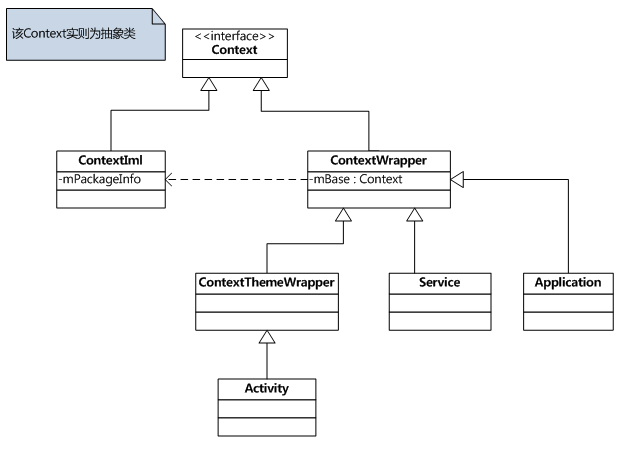

### Android Context
#### 什么是Android Context
一个Context意味着一个场景，一个场景就是我们和软件进行交互的一个过程

#### 一个应用程序中应该有多少个Context对象


Context类本身是一个纯abstract类。为了使用方便又定义Context包装类-ContextWrapper,
ContextWrapper构造函数中必须包含一个真正Context引用，同时ContextWrapper中有attachBaseContext()
用于给ContextWrapper对象中指定真正的Context对象.

ContextThemeWrapper内部包含了与主题相关的接口。这里的主题就是指在Androidmanifest.xml中通过android:theme
为Application或者Activity指定的主题。
只有Activity才需要主题，Service默默的后台工作不需要，所以Service直接继承ContextWrapper

ContextImpl类真正实现了Context中所有的函数。

#### 什么时候创建的Context
每一个应用程序在客户端都是ActivityThread类开始的，创建Context对象也是在该类中完成，
具体创建ContextImpl类的地方6处：
* PackageInfo.makeApplication()
* performLaunchActivity()
* handleCreateBackupAgent()
* handleCreateService()
* handleBindApplication()
* attch()

其中attach()方法仅在Framework进程启动时调用，应用程序运行时不会调用该方法。

#### Application对应的Context
程序第一次启动时，会辗转调用makeApplication()方法。
具体代码：
```java
ContextImpl appContext = new ContextImpl();
appContext.init(this,null,mActivityThread);
appContext.setOuterContext(app);
```

#### Activity对应的Context
启动Activity,Ams会通过IPC调用到ActivityThread的scheduleLaunchActivity()方法，

