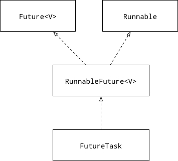

# FutureTask
FutureTask：一个可以取消的异步任务执行类，这个类提供了Future接口的基本实现，主要有以下功能：
- 异步执行任务
- 可以开始、取消以及查看任务是否完成
- 如果任务没有执行完，get方法会导致线程阻塞
- 一旦一个执行任务已经完成就不能再次开始和结束(除非执行时通过runAndReset()方法)

## 类关系


## 成员变量
|修饰符|变量名|描述|
|:---:|:---:|:---:|
|Callable|callable|任务执行体|
|Object|outcone|最终输出的结果|
|volatile Thread|runner|异步执行任务的线程|
|volatile WaitNode|waiters|获取任务结果的等待线程(是一个链式列表)|
|volatile int|state|当前一步任务的状态|
|static final int|NEW|任务初始状态|
|static final int|COMPLETING|任务已完成，但结果还没有复制给outcome|
|static final int|NORMAL|任务执行完成|
|static final int|EXCEPTIONAL|任务执行异常|
|static final int|INTERRUPTING|任务被中断中|
|static final int|INTERRUPTED|任务被中断|

## 构造函数及方法
通过传入Callable来构造一个任务
```java
public FuntureTask(Callable callable) {
    if (callable == null)
        throw new NullPointerException();
    this.callable = callable;
    this.state = NEW;
}
```
通过传入Runnable来构造一个任务
```java
public FuntureTask(Runnable runnable, V result) {
    this.callable = Executors.callable(runnable, result);
    this.state = NEW;
}
```

|修饰符|方法|描述|
|boolean|cancle(boolean mayInterruptfRunning)|取消或者中断任务(true为中断，false为取消)|
|V|get()|返回执行结果，行为完成执行时，则阻塞线程|
|V|get(long timeout, TimeUnit unit)|获取执行结果，当时间超出设定时间时，则返回超时|
|boolean|isCancelled()|返回任务是否已经取消|
|boolean|isDone()|判断任务是否执行完毕|

## 执行状态转换
执行任务时可能有4种状态转换：
1. 任务顺利执行：NEW->COMPLETING->NORMAL
2. 任务执行异常：NEW->COMPLETING->EXCEPTIONAL
3. 任务取消：NEW->CANCELLED
4. 任务终端：NEW->INTERRUPTING->INTERRUPTED


