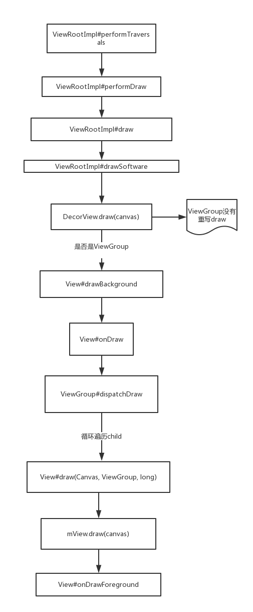

任何一控件其实都是直接或间接继承自View实现的，所以说View应该具有相同的绘制流程与机制才能显示到屏幕上
每一个View的绘制过程都必须经历三个最主要的过程，也就是measure、layout和draw。

```
├── View
│   ├── measure(int, int)
|   ├── onMeasure(int, int)
|   ├── layout(int, int, int, int)
|   ├── onLayout(boolean, int, int, int, int)
|   ├── onDraw(Canvas)
|   ├── draw(Canvas)
|   ├── draw(Canvas, ViewGroup, long)

├── ViewGroup
│   ├── layout(int, int, int, int) //ViewGroup实现了
│   ├── onLayout(boolean, int, int, int, int) //viewGroup是一个抽象类 需要实现
```

## 初始化工作
Activity方法onCreate里执行了setContentView只有View如何显示到屏幕上的。
1. Activity.setContentView->PhoneWindow.setContentView最终会生成一个DecorView对象
2. DecoreView是PhoneWindow类的内部类，继承自FrameLayout，所以调用Activity方法


## 开始
整个View树的绘图流程是在ViewRootImpl类的performTraversals()方法，该函数做的执行过程主要是根据之前设置的状态，判断是否重新计算视图大小
(measure)、是否重新放置视图的位置(layout)、以及是否重绘(draw)，其核心也就是判断来选择顺序执行这三个方法中的哪个。

LayoutParams:
LayoutParams are used by views to tell their parents how they want to be

MeasureSpec:
A MeasureSpec encapsulates the layout requirements passed from parent to child.

MeasureSpec并不是指View的测量宽高，MeasureSpec作用在于：在Measure流程中，系统会将
View的LayoutParams根据父容器所施加的规则转换成对应的MeasureSpec，
然后在onMeasure方法中根据这个MeasureSpec来确定View的测量宽高。

> UPSPECIFIED : 父容器对于子容器没有任何限制,子容器想要多大就多大  
EXACTLY: 父容器已经为子容器设置了尺寸,子容器应当服从这些边界,不论子容器想要多大的空间。  
AT_MOST：子容器可以是声明大小内的任意大小

```java
int childWidthMeasureSpec = getRootMeasureSpec(mWidth, lp.width);
int childHeightMeasureSpec = getRootMeasureSpec(mHeight, lp.height);
 // Ask host how big it wants to be
performMeasure(childWidthMeasureSpec, childHeightMeasureSpec);
```

## measure测量流程
### ViewGroup的测量过程
由于DecodeView继承自FrameLayout，是PhoneWindow的一个内部类，而FrameLayout没有measure方法，因此调用的是父类View
的measure方法，
```java
public final void measure(int widthMeasureSpec, int heightMeasureSpec) {
        boolean optical = isLayoutModeOptical(this);
        if (optical != isLayoutModeOptical(mParent)) {
        ...
        if ((mPrivateFlags & PFLAG_FORCE_LAYOUT) == PFLAG_FORCE_LAYOUT ||
                widthMeasureSpec != mOldWidthMeasureSpec ||
                heightMeasureSpec != mOldHeightMeasureSpec) {
            ...
            if (cacheIndex < 0 || sIgnoreMeasureCache) {
                // measure ourselves, this should set the measured dimension flag back
                onMeasure(widthMeasureSpec, heightMeasureSpec);
                mPrivateFlags3 &= ~PFLAG3_MEASURE_NEEDED_BEFORE_LAYOUT;
            } 
        ...
}
```

最后会调用super.onMeasure， onMeasure不同的ViewGroup有着不同的实现，但大体是对每个子View进行遍历，根据ViewGroup的
MeasureSpec及子View的layoutParams来确定自身的测量宽高，然后根据所有子View的测量宽高信息再确定父容器的测量宽高。

### View的测量过程
ViewGroup提到measureChildWithMargin方法，它接收的主要参数是子View以及父容器的MeasureSpec，所以它的作用就是对子View进行测量，
ViewGroup#measureChildWithMargins:
|子View的LayoutParams\父容器SpecMode|EXACTLY|AT_MOST|UNSPECIFIED|
| ---- | ---- | ---- | ---- |
|精确值(dp)|EXACTLY childSize|EXACTLY childSize|EXACTLY childSize|
|match_parent|EXACTLY parentSize|AT\_MOST parentSize|UNSPECIFIED 0|
|wrap_content|AT_MOST parentSize|AT\_MOST parentSize|UNSPECIFIED 0|

通过获取子View的MeasureSpec获得后，执行child.measure，绘制流程已经从ViewGroup转移到子View中了，
在measure方法中会调用onMeasure方法，
```java
protected void onMeasure(int widthMeasureSpec, int heightMeasureSpec) {
        setMeasuredDimension(getDefaultSize(getSuggestedMinimumWidth(), widthMeasureSpec),
        getDefaultSize(getSuggestedMinimumHeight(), heightMeasureSpec));
}
```

### 总结
测量始于DecorView，通过不断的遍历子View的measure方法，根据ViewGroup的MeasureSpec及子View的LayoutParams来决定
子View的MeasureSpec，进一步获取子View的测量宽高，然后逐层返回，不断保存ViewGroup的测量高度。

## layout流程
### ViewGroup的布局流程
performLayout方法进行layout流程
通过对mLeft、mTop、mRight、mBottom这四个值进行了初始化，对于每一个View，包括ViewGroup来说，以上四个值保存了
View的位置信息，所以这四个值是最终宽高。也即是说，如果要得到View的位置信息，那么就应该在layout方法完成后调用
getLeft(),getTop()等方法来取得最终宽高，如果是在此之前调用相应的方法，只能得到0的结果，所以一般我们是在onLayout
方法中获取View的宽高信息。

首先先获取父容器的padding值，然后遍历其每一个子View，  
根据子View的layout_gravity属性、子View的测量宽高、父容器的padding值、来确定子View的布局参数，  
然后调用child.layout方法，把布局流程从父容器传递到子元素

### 子View的布局流程
子View的布局流程也很简单。如果子View是一个ViewGroup,那么会重复以上步骤，如果是一个View，那么会直接调用  
View#layout方法，根据以上分析，在该方法内部会设置view的四个布局参数，接着调用onLayout方法，
View#onLayout方法是一个空实现，主要作用是在我们自定义View中重写该方法，实现自定义的布局逻辑。

### 总结
View的布局流程就已经全部分析完了。可以看出，布局流程的逻辑相比测量流程来说，简单许多，  
获取一个View的测量宽高是比较复杂的，而布局流程则是根据已经获得的测量宽高进而确定一个View的四个位置参数

## draw流程

绘制流程将决定View的样子，一个View该显示什么由绘制流程完成。
### ViewRootImpl#performDraw

里面又调用了ViewRootImpl#draw方法，并传递了fullRedrawNeeded参数。
该参数由mFullRedrawNeeded成员变量获取，它的作用是判断是否重新绘制全部视图，如果是第一次绘制视图，
那么显示应该绘绘制所有的视图，如果由于某些原因，导致了视图重绘，那么就没有必要绘制所有视图。

### ViewRootImpl#draw
首先获取了mDirty值，该值保存了需要重绘区域的信息，关于视图绘制。根据fullRedrawNeeded来判断是否需要
重置dirty区域，最后调用了ViewRootImpl#drawSoftware方法，并把相关参数传递进去，包括dirty区域

首先实例化了Canvas对象，然后锁定该canvas的区域，由dirty区域决定，接着对canvas进行一系列的属性赋值，
最后调用了mView.draw方法，前面分析过mView就是DecorView，也就是说从DecorView开始绘制。

### View的绘制流程
由于ViewGroup没有重写draw方法，因此所有的View都是调用View#draw
绘制流程的六个步骤：
1. 对View的背景进行绘制
2. 保存当前的图层信息
3. 绘制View的内容
4. 对View的子View进行绘制
5. 绘制View的褪色的边缘，类似于阴影效果。
6. 绘制View的装饰


