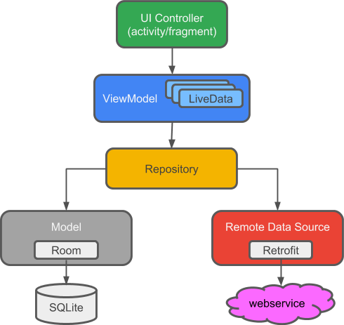

Android Architecture Components
是一个由官方推出的新库，它能够帮助你去构建一个健壮，易测，可维护的应用

# 架构原则
1. 在应用中的关注点分离。比如在一个Activity或者Fragment中写所有的代码明显是错误的。任何与
UI或者交互无关的代码都不应该存在这些类中。保证他们尽可能的职责单一化将会使我们避免很多生命周期相关的问题。
Android系统可能会随时由于用户的行为或者系统状态(比如剩余内存过低)而销毁你的应用组件
2. 应该采用数据模型驱动UI的方式，最好是一个可持久化的模型。
持久化被建议的原因有两个：
1. 用户不会因为系统销毁我们的应用而导致丢失数据
2. 我们的应用可以在网络状况不好甚至断网的情况下继续工作

* *UI Controllers* - UI Controllers 是activities或者是fragments，只做如何显示数据和传递事件UI，UI Controllers既不包含UI数据也不直接操作数据。
* *ViewModel 和LiveData*-这些类代表UI所显示的所有的数据
* *Repository*-这个类是所有应用数据的真实来源并且充当UI进行通信的干净API。ViewModels只需从存储库中请求数据，他们不需要担心repository从数据库或者网络，或者如何或何时保存数据。存储是不同数据源之间的中介。
* *Remote Network Data Source*-管理远端数据源，比如网络
* *Model*-管理存储在数据库的本地数据

# Lifecycles
生命周期管理(Lifecycles)帮助开发者创建“可感知生命周期的”组件，让其自己管理自己的生命周期，从而减少内存泄露和崩溃的可能性。
生命周期库是其他架构组件的基础
- `ProcessLifecycleOwnerInitializer`初始化Lifecycle框架
- `LifecycleDispatcher` 通过ActivityLifecycleCallbacks与LifecycleDispatcher配合监听当前进程中Activitys的生命周期变化并在必要时产生相应lifecycle事件
- `ProcessLifecycleOwner`通过ActivityLifecycleCallbacks与LifecycleDispatcher配合监听当前进程中Activitys的生命周期变化并在必要时产生相应的lifecycle事件
- `LifecycleService`，通过重写Service的生命周期方法并在相应方法内产生相应的lifecycle事件

## LifecycleRegistry的addObserver流程

# LiveData
LiveData是一款基于观察者模式的可感知生命周期的核心组件。LiveData为界面代码(Observer)的监视对象(Observable)。当LiveData
所持有的数据改变时，它会通知相应的界面代码进行更新。同时，LiveData持有界面代码Lifecycle的引用，这意味着它会在界面代码
(LifecycleOwner)的生命周期处于stated或resumed时作出相应更新，而在LifecycleOwner被销毁时停止更新。
通过LiveData，开发者可以方便地构建安全性更高、性能更好的高响应度用户界面

# ViewModel
ViewModel将视图的数据和逻辑从具有生命周期特性的实体(如Activity和Fragment)中剥离开来。
直到关联Activity或Fragment完全销毁时，ViewModel才会随之消失，也就是说，即使在旋转屏幕导致Fragment被重新创建等事件中，
视图数据依旧会被保留。ViewModel不仅消除了常见的生命周期问题，而且可以帮助构建更为模块、更方便测试的用户界面

# Room
和 SQLite 有一样强大的功能，但是节省了很多重复编码的麻烦事儿。它的一些功能，如编译时的数据查询验证、内置迁移支持等，让开发者能够更简单地构建健壮的持久层。而且 Room 可以和 LiveData 集成在一起，提供可观测数据库并感知生命周期的对象。Room 集简洁、强大和可靠性为一身，在管理本地储存上表现卓越.
- 模板代码更少。它将数据库对象映射到Java对象。这意味着不需要使用ContentValues或者Cursors
- 编译时验证SQL语句，而不是在运行时
- 允许通过LiveData和RxJava进行数据观察
组成部分：

* @Entity 这个组件定义了数据表的模式。模型对象可以很容易地转换为实体对象
* @Dao 该组件将类或接口表示为数据访问对象(Dao)，Dao负责定义访问数据库的方法。他们提供了一个读取和写入数据库数据的API
* @Database 这个组件代表一个数据库持有者。在这个类定义数据的实体列表和数据的数据访问对象(Dao)。然后你使用这个类来创建一个新的数据库或者运行时获得一个到数据库的连接

# Repository 
存储库类负责处理数据操作，它们为程序提供了一个干净的API，它们知道从何处获取数据以及更新数据时调用API。它们是不同数据源之间的中介。
与Room，LiveData或ViewModels，Repository不会扩展或实现架构组件库，这只是在“应用程序指南”体系结构中描述的应用程序中组织数据的一种方法
# PagedList
解决RecyclerView处理大数据集的困难 