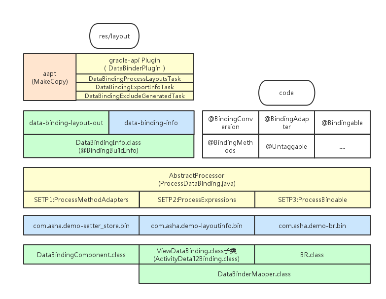

[DataBinding源码解析](https://juejin.im/entry/59e2ddf451882578d02f445f)

# 注解

1. 运行时注解，性能有问题
2. 编译时注解，核心依赖[APT(Annotation Processing Tools)](../aosp/annotationprocessingtools.md)实现

    原理是在某些代码元素上(如类型、函数、字段等)添加注解，在编译时编译器会检查AbstactProcess的子类
    并且调用该类型的process函数，然后将添加了注解的所有元素都传递到process函数中，使得开发人员可以在
    编译器进行相应的处理。
    Java API已经提供了扫描源码并解析注解的框架，你可以继承AbstractProcess类来提供实现自己的解析注解逻辑

## 虚处理器AbstractProcessor

- `init(ProcessingEnvironment env)`：每一个注解处理器类都必须有一个空的构造函数，特殊方法`init`，它会被处理工具调用，并输入`ProcessingEnviroment`参数。在`init()`中将获得如下引用：
  - **Elements**：一个用来处理`Element`的工具类，`Elements`代表的是源代码，`TypeElement`代表的是源代码中的类型元素。
  - **Types**：一个用来处理`TypeMirror`的工具类，`TypeMirror`代表类的信息。`TypeMirror`可以通过`Element.asType()`
  - **Filer**：使用Filer可以创建文件

- `process(Set<? extends TypeElement> annotations, RoundEnvironment env)`这相当于每个处理器的主函数`main()`。这里可以写
    你的扫描、评估和处理注解的代码，以及生产Java文件。输入参数`RoundEnviroment`，可以让你查询出包含特定注解的被注解元素

- `getSupportedAnnotationTypes()`：这里你必须指定，这个注解处理器是注册给哪个注解的。注意，它的返回值是一个字符串集合，包含本处理器想要处理的注解类型的合法全称。
- `getSupportedSourceVersion()`：用来指定你使用的Java版本，通常这里返回`SourceVersion.lasterSupported()`

注解处理器是运行它自己的虚拟机JVM中。javac启动一个完整java虚拟机来运行注解处理器。

## 处理循环

> 注解处理过程有一个有序的循环过程。在每次循环中，一个处理器可能被要求去处理那些在上一次循环中产生的
源文件和类文件中的注解。第一次循环的输入是运行此工具的初始输入。这些初始输入，可以看成是虚拟的第0次的循环输出

## ProcessDataBinding

1. SupportedAnnotationTypes 用来指示注释处理器支持哪些注释类型的注释，`Processor.getSupportedAnnotationTypes`方法可以根据此注释的值构造它的结果
2. ProcessMethodAdapters负责处理@BindingAdapter、@BindingMethods、@BindingConversion等注解，并将相关信息通过SetterStore保存起来
3. ProcessExpressions负责处理layout文件，将layout文件转换为正常布局和包含绑定信息，总结起来就是解析xml布局，解析里面的layout、import、variables等标签，然后生成文件。

4. ProcessBindable负责生成BR类。生成好BR类。

5. 利用DataBinderWriter.kt与LayoutBinderWriter.kt生成DataBinderMapper与ViewBinding类

## 问题

- Databinding如何避免findViewById的？
- Databinding中是如何实现当V的变化同步更新到VM的？
- Databinding中是如何实现将VM的数据绑定到V的？

# DataBinding利用编译器在背后做的那些事儿

