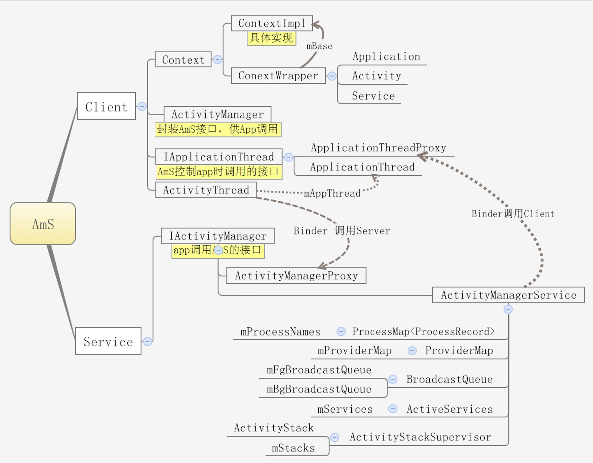

# 插件化原因

1. 减少升级成本
2. 解决app 65536问题(Multidex方案之前，现在该问题并不是插件化原因)
3. 减少app包大小
4. 快速修改线上BUG或者发布新功能
5. 模块解耦，协同开发

四大组件都是需要在AndroidManifest中注册的，而插件apk中的组件是不可能预先知晓名字，所以需要hack方案类解决。

|组件|解决方案|
|:--:|:---:|
|Activity|在宿主apk中提前占几个坑，通过“欺上瞒下”的方式，启动插件apk的Activity；因为要支持不同的launchMode以及一些特殊的属性，需要占多个坑|
|Service|通过代理Service的方式去分发；主进程和其他进程，VirtualAPK使用两个代理|
|BroadcastReceiver|静态转动态|
|ContentProvider|通过一个代理的Provider进行分发|

- ActivityThread：管理着一个主线程的执行应用程序进程，调度和执行活动，广播和其他操作作为活动管理请求
- Instrumentation: 该类会在应用的任何代码执行前被实例化，用来监控系统与应用的交互。可以以应用的AndroidManifest.xml中`<instrumentation>`标签来注册一个Instrumentation的实现
- ActivityManager: 这个类提供有关信息，并进行交互activities、services、和包含的process。这个类中的一些方法是用于调试或信息的目的，他们应该不能影响任何运行时的行为。大多数应用程序开发人员不应该需要使用这个类，其中大多数的方法是专门用例。

- DexClassLoader：能够加载自定义的jar/apk/dex
- PathClassLoader：只能加载系统中已经安装过的apk
  所以Android系统默认的类加载器为PathClassLoader，而DexClassLoader可以像JVM的ClassLoader一样提供动态加载。

- ActivityManagerService简称AMS，是android内核三大功能之一(另外两个是WindowManagerService和View)
  AMS主要提供主要功能
  
    1. 统一调试应用的Activity。应用程序要运行Activity，首先会报告给AMS，然后由AMS决定该Activity是否启动
    2. 内存管理。Activity退出后，其所有的进程并不会被立即杀死，从而在下次启动的时候，提高Activity的启动速度。这些Activity只有在内存吃紧的时候，才会被自动杀死
    3. 进程管理。AMS向外提供了查询系统正在运行的进程API

## Activity支持

### 启动插件Activity

```java
//优先根据包名判断该插件是否已经加载，
public class MainActivity extends AppCompatActivity {
public void onButtonClick(View v) {
  if (PluginManager.getInstance(this).getLoadedPlugin(pkg) == null) {

      Toast.makeText(this, "plugin [com.didi.virtualapk.demo] not loaded", Toast.LENGTH_SHORT).show();
      return;
  }
  Intent intent = new Intent();
  intent.setClassName(this, "com.didi.virtualapk.demo.aidl.BookManagerActivity");
  startActivity(intent);
}
}
```

### 初始化插件加载构建

1. 调用`PackageParser.parsePackage`解析apk里面各种信息，parsePackage中调用了系统的PackageParser去解析各种信息，并做了不同版本的兼容处理
2. 区分是否是Constants.COMBINE_RESOURCES模式，构造不同的Resources
3. 创建每个插件apk的DexClassLoader，区分是否是Constants.COMBINE_CLASSLOADER，并合并插件的dex到宿主APK的dex文件中。false，不合并。并且无论合并还是不合并，LoadedPlugin中都保存了插件APK对应的DexClassLoader。
4. 获取四大组件信息
5. 动态注册所有静态Receiver

```java
public class PluginManger {
  public void loadPlugin(File apk) throws Exception {
    if (null == apk) {
      throw new IllegalArgumentException("error : apk is null.")
    }
    if (!apk.exists()) {
      throw new FillNotFoundException(apk.getAbsolutePath());
    }
    LoadedPlugin plugin = LoadedPlugin.create(this, this.mContext, apk);
    if (null != plugin) {
      this.mPlugins.put(plugin.getPackageName(), plugin);

      plugin.invokeApplication();
    } else {
      throw new RuntimeException("can't load plugin which is invalid: " + apk.getAbsolutePath());
    }
  }
}
```

```java
public class LoadedPlugin {
  public static LoadedPlugin create(PluginManager pluginManager, Context host, File apk) {
    return new LoadedPlugin(pluginManager, host, apk);
  }
}
```

```java
public final class LoadedPlugin {
  LoadedPlugin(PluginManager plugManagerr, Context context, File apk) throws PackageParser.PackageParserException {
    ...
    this.mPackage = PackageParserCompat.parsePackage(context, apk, PackageParser.PARSE_MUST_BE_APK);
    this.mResource = createResources(context, apk);
    this.mClassLoader = createClassLoader(context, apk, this.mNativeLibDir, context.getClassLoader());

    tryToCopyNativeLib(apk);

    //缓存住instrumentation
    Map<ComponentName, InstrumentationInfo> instrumentations  = new Hash<ComponentName, InstrumentationInfo>();
    for (PackageParser.Instrumentation instrumentation : this.mPackage.instrumentation) {
      instrumenttation.put(instrumentation.getComponentName(), instrumenttation.info);
    }
    this.mInstrumentationInfos = Collections.unmodifiableMap(instrumentations);
    this.mPackageInfo.instrumentation = instrumentation.values().toArray(new InstrumentationInfo[instrumentations.size()]);

    //缓存住activities
    Map<ComponentName, ActivityInfo> activityInfos = new HashMap<ComponentName, ActivityInfo>();
    for (PackageParser.Activity activity : this.mPackage.activities) {
      activityInfos.put(activity.getComponentName(), activity.info);
    }
    this.mActivityInfos = Collections.unmodifiableMap(activityInfos);
    this.mPackageInfo.activities = activityInfos.value()
    .toArray(new ActivityInfo[activityInfos.size()]);
    //缓存住services
    Map<ComponentName, ServiceInfo> serviceInfos = new Hash<ComponentName, ServiceInfo>();
    for (PackageParser.Service service : this.mPackage.services) {
      serviceInfos.put(service.getComponentName(), service.info);
    }
    this.mServiceInfos = Collection.unmodifiableMap(serviceInfos);
    this.mPackageInfo.services = serviceInfos.values().toArray(new ServiceInfo[])
    //缓存住providers
    Map<String, ProviderInfo> providers = new HashMap<String, ProviderInfo>();
    Map<ComponentName, ProviderInfo> providerInfos = Hash<ComponentName, ProviderInfo>();
    for (PackageParser.Provider provider : this.mPackage.providers) {
      providers.put(provider.info.authority, provider.info);
      prividerInfos.put(provider.getComponentName(), provider.info);
    }
    this.mProviders  = Collections.unmodifiableMap(providers);
    this.mProviderInfos = Cooliections.unmodifiableMap(providerInfos);
    this.mPackageInfo.providers = providerInfos.values().toArray(new ProviderInfo[providerInfos.size()]);

    //缓存住receiver
    Map<ComponentName, ActivityInfo> receivers = new HashMap<ComponentName, ActivityInfo>();

    for (PackageParser.Activity receiver : this.mPackage.receivers) {
      receivers.put(receiver.getComponentName(), receiver.info);
    }

    try {
      BroadcastReceiver br = BroadcastReceiver.class.cast(getClassLoader().loadClass(receiver.getComponentName().getClassName())
      .newInstance());
      for (PackageParser.ActivityIntentInfo aii : receiver.intent) {
        this.mHostContext.registerReceiver(br, aii);
      }
    } catch (Exception e) {
      e.printStackTrace();
    }
    this.mReceiverInfos = Collections.unmodifiableMap(receivers);
    this.mPackageInfo.receivers = receivers.values().toArray(new ActivityInfo[receivers.size]);

  }
}
```

### 读取Manifest信息

```java
public final class PackageParserCompat {
  public static final PackageParser.Package parsePackage(final Context context, final File apk, final int flags) throws PackageParser.PackageParserException {
    if (Build.VERSION.SDK_INT >= 24) {
      return PackageParserV24.parsePackage(context, apk, flags);
    } else if (Build.VERSION.SDK_INT >= 21) {
      return PackageParserLollipop.parsePackage(context, apk, flags);
    } else {
      return PackageParserLegacy.parsePackage(context, apk, flags);
    }
  }
}
```

```java
public class PackageParser {
  public Package parsePackage(File packageFile, int flags, boolean useCaches) throws PackageParserException {
    Package parsed = useCaches ? getCachedResult(packageFile, flags) : null;
    if (parsed != null) {
      return parsed;
    }
    long parseTime = LOG_PARSE_TIMINGS ? SystemClock.uptimeMillis() : 0;
    if (packageFile.isDirectory()) {
      parsed = parseClusterPackage(packageFile, flags);
    } else {
      parsed = parseMonolithicPackage(packageFile, flags);
    }

    long cacheTime = LOG_PARSE_TIMINGS ? SystemClock.uptimeMillis() : 0;
    cacheResult(packageFile, flags, parsed);
  }
}
```

#### 创建Resource

两种方式
[VirtualAPK 资源篇](vritual_resource.md)

```java
public final class LoadedPlugin {
  private static Resource createResource(Context context, File apk) {
    if (Context.COMBINE_RESOURCES) {
      // 默认
      // 在这种模式下，会将插件apk的资源和宿主apk的资源合并
      Resources resources = ResourcesManager.createResources(context, apk.getAbsolutePath());
      ResourcesManager.hookResources(context, resources);
      return resources;
    } else {
      Resources hostResources = context.getResources();
      AssetManager assetManager = createAssetManager(context, apk);
      return new Resources(assetManager, hostResources.getDisplayMetrics(), hostResources.getConfiguration());
    }

  }
}
```

#### 创建ClassLoader

```java
public final class LoadedPlugin {
  public static ClassLoader createClassLoader(Context context, File apk, File libsDir, ClassLoader parent) {
    File dexOutputDir = context.getDir(Constants.OPTIMIZE_DIR, Context.MODE_PRIVATE);
    String dexOutputPath  = dexOutputDir.getAbsolutePath();
    DexClassLoader loader = new DexClassLoader(apk.getAbsolutePath(), dexOutputPath, libsDir.getAbsolutePath(), parent);

    if (Contexts.COMBINE_CLASSLOADER) {
      try {
        DexUtil.insertDex(loader);
      } catch (Exception e) {
        e.printStackTrace();
      }
    }
    return loader;

  }
}
```

```java
public class DexUtil {
  public static void insertDext(DexClassLoader dexClassLoader) throws Exception{
    Object baseDexElements = getDexElements(getPathList(getPathClassLoader()));
    Object newDexElements = getDexElements(getPathList(dexPathClassLoader));
    Object allDexElements = combineArray(baseDexElements, newDexElements);
    Object pathList = getPathList(getPathClassLoader());
    ReflectUtil.setField(pathList.getClass(), pathList, "dexElements", allDexElements);
    insertNativeLibrary(dexClassLoader);
  }
}
```

## 四大组件的启动

[四大组件](virtual_componet.md)