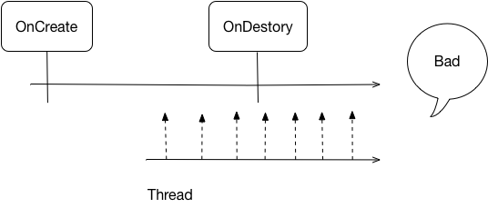

[Threading Performance](http://www.cnblogs.com/bugly/p/5519510.html)
* AsyncTask:为UI线程与工作线程之间进行快速的切换提供一种简单便捷的机制。适用于当下立即需要启动，
但是异步执行的生命周期短暂的使用场景
* HandlerThread:为某些回调方法或者等待某些任务的执行设置一个专属的线程，并提供线程任务的调度机制。
* ThreadPool：把任务分解成不同的单元，分发到各个不同的线程上，进行同时并发处理。
* IntentService:适合于执行由UI触发的后台Service任务，并可以把后台任务执行的情况通过一定的机制反馈给UI。

使用AsyncTask需要注意的问题：
1. 默认情况下，所有的AsyncTask任务都是被线性调度执行的，他们处于同一任务队列当中，按顺序逐个执行。假设你按照
启动20个AsyncTask，一旦其中的某个AsyncTask执行时间过长，队列中的其他剩余AsyncTask都处于阻塞状态，必须等到该任务执行完毕
之后才能够有机会执行下一个任务。

2. 为了解决上面提到的线性队列等待的问题，我们可以使用`AsyncTask.executeOnExecutor`强制指定AsyncTask使用线程池并发调度
任务。

3. 如何才能够真正的取消一个AsyncTask的执行呢？  
AsyncTask有提供`cancel()`的方法，线程本身并不具备中止正在执行的代码的能力，为了能够让一个线程更早的被销毁，
需要在`doInBackground()`代码中不断的添加程序是否被中止的判断逻辑(`isCancelled()`)。
AsyncTask调用cancel()在`doInBackground()`执行完毕后，走的是`onCanceled`而不是`onPostExecute`，并且
cancel并不能真正立即取消task，如果想要立即取消还需要isCancelled()方法来辅助。

4. 使用AsyncTask很容易导致内存泄露，一旦把AsyncTask写成Activity的内部类的形式很容易因为AsyncTask生命周期的不确定而导致Activity发生泄露。

5. AsyncTask都能够满足多线程并发的场景需要（在工作线程执行任何并返回结果到主线程），但是它并不是万能的。
例如打开相机之后预览帧是通过`onPreviewFrame()`的方法进行回调，
`onPreviewFrame()`和`open()`相机的方法是执行在同一个线程的

HandlerThread 比较合适处理那些在工作线程执行，需要花费时间偏长的任务。我们只需要把任务发送给 HandlerThread，然后就只需要等待任务执行结束的时候通知返回到主线程就好了。
另外很重要的一点是，一旦我们使用了 HandlerThread，需要特别注意给 HandlerThread 设置不同的线程优先级，CPU 会根据设置的不同线程优先级对所有的线程进行调度优化。

## Swimming in Threadpools
线程池适合用在把任务进行分解，并发进行执行的场景。通常来说，系统里面会针对不同的任务设置一个单独的守护线程用来专门处理这项任务。
例如使用Networking Thread用来专门处理网络请求的操作，使用IO Thread用来专门处理系统的I\O操作。
针对那些场景，这样设计是没有问题的，因为对应的任务单词执行的时间并不长并且可以是顺序执行的。但是
这种专属的单线程并不能满足所有的情况。

系统提供了`ThreadPoolExecutor`帮助类来简化实现，剩下需要做的就只是对任务进行分解就好了。

使用线程池需要特别注意同时并发线程数量的控制，理论上来说，我们可以设置任意你想要的并发数量，但是这样
做非常的不好，因为CPU只能同时执行固定数量的线程数，一旦同时并发的线程数量超过CPU能够同时的阈值，CPU就
需要花费精力来判断到底哪些线程的优先级比较高，需要在不同的线程之间进行切换。

一旦同时并发的线程数量达到一定的量级，这个时候CPU在不同线程之间进行调度的时间就可能过长，反而导致性能严重下降。
另外需要关注的一点是，每开一个新的线程，都会耗费64K+的内存。为了方便对线程数量进行控制，
ThreadPoolExecutor为我们提供了初始化的并发线程数量，以及最大的并发数量进行控制，

## The Zen of IntentService
默认的Service是执行在主线程的，可是通常情况下，这很容易影响到程序的绘制性能（抢了主线程的资源）。除了前面介绍的
AsyncTask与HandlerThread，还可以选择使用IntentService来实现异步操作。IntentService继承来自
普通Service同时又在内部创建了一个HandlerTrhead，在`onHandlerIntent()`的回调里面处理扔到IntentService的
任务。所以IntentService就不仅仅具备了异步线程的特性，还同时保留了Service不受页面生命周期影响的特点。

IntentService里面通过设置闹钟间歇性的触发异步任务，例如刷新数据，更新缓存的图片。
使用IntentService需要留意一下几点：
* 首先，因为IntentService内置的是HandlerThread作为异步线程，所以每一个交给IntentService的任务都将以
队列的方式逐个被执行到，一旦队列中有某个任务执行时间过长，那么就会导致后续的任务都会被延迟处理。

* 其次，通常使用到IntentService的时候，我们会结合使用BroadcastReceiver把工作线程的任务执行结果返回给主UI线程。
使用广播容易引起性能问题，我们可以使用LocalBroadcastManager来发送只在程序内部传递的广播，从而提升广播
的性能。我们也可以使用`runOnUiThread()`快速回调到主UI线程。

* 最后，包含正在运行的IntentService的程序相比起纯粹的后台程序更不容易被系统杀死，该程序的优先级是介于前台程序与纯后台
程序之间。

## Threading and Loaders
当启动工作线程的Activity被销毁的时候，我们应该做点什么呢？为了方便的控制工作线程的启动与结束，Android为我们引入Loader
来解决这个问题。我们知道Activity有可能因为用户的主动切换而频繁的被创建于销毁，也有可能是因为
类似屏幕发生旋转等被动原因而销毁而重建。在Activity不停的创建于销毁的过程当中，很有可能因为工作线程持有
Activity的View而导致内存泄露。

Loader的出现就是为了确保工程线程能够和Activity的生命周期保持一致，同时避免出现前面提到的问题。

LoaderManager会对查询的操作进行缓存，只要对应Cursor上的数据源没有发生变化，在配置信息发生改变的时候，
Loader可以直接把缓存的数据回调到`onLoadFinished()`，从而避免重新查询数据。另外系统会在Loader不再需要使用
的时候回调`onLoaderReset()`方法，我们可以在这里做数据的清除等等。

## The Importance of Thread Priority
理论上来说，我们的程序可以创建出非常多的子线程一起并发执行的，可是基于CPU时间片轮转调度的机制，不可能所有的线程都可以同时被调度
执行，CPU需要根据线程的优先级赋予不同的时间片。

Android系统会根据当前运行的可见的程序和不可见的后台程序进行归类，划分为forground的那部分线程
大致占用掉CPU的90%左右的时间片，background的那部分线程就总共只能分享到5%~10%左右的时间片。
之所以设计成这样是因为forground的程序本身的优先级就更高，理应得到更多的执行时间。

默认情况下，新创建的线程的优先级默认和创建它的母线程保持一致。
如果主 UI 线程创建出了几十个工作线程，这些工作线程的优先级就默认和主线程保持一致了，为了不让新创建的工作线程和主线程抢占 CPU 资源，
需要把这些线程的优先级进行降低处理，这样才能给帮组 CPU 识别主次，提高主线程所能得到的系统资源。

在Android系统里面，我们可以通过`android.os.Process.setThreadPriority(int)`设置线程的优先级，参数
范围从-20到19，数值越小优先级越高。Android系统还为我们提供了以下的一些预设值，我们可以通过给不同的工作线程设置不同
数值的优先级来达到更细粒度的控制。

大多数情况下，新创建的线程优先级会被设置为默认的0，主线程设置为0的时候，新创建的线程还可以利用
`THREAD_PRIORITY_LESS_FAVORABLE` 或者 `THREAD_PRIORITY_MORE_FAVORABLE` 来控制线程的优先级。

Android系统里面的AsyncTask与IntentService已经默认帮助我们设置线程的优先级。

## Android多线程知识总结——源码分析

### ThreadPoolExecutor
ThreadPoolExecutor是Executorservice的实现，它使用线程池中的任意一个线程来执行提交的任务，这些线程通常是用来Executors的工厂方法配置的。

线程池解决了两个不同的问题：
* 他们可以在执行大量异步任务的时候提高性能表现，因为减少了每个任务的调度开销
* 它们提供了限制和管理在执行任务集合时消耗的资源的手段
* 除此之外，每个ThreadPoolExecutor还维护一些基本统计信息

Executors工厂方法：
* newCachedThreadPool--线程池中线程数量不受限制，有自动线程回收
* newFixedThreadPool(int)--固定大小线程池
* newSingleThreadExecutor()--单后台线程
* newScheduledThreadPool--核心线程数固定的，非核心线程数是非固定的。当非核心线程空闲时会被立刻回收

* corePoolSize：核心池的大小，在创建线程池后，线程池中并没有任何线程，而是等待有任务到来才创建线程去执行任务。
默认情况下，在创建了线程池后，线程池中的线程数为0，当有任务来之后，就会创建一个线程去执行任务，当线程池中的线程
数目达到corePoolSize后，就会到达的任务放到缓存队列当中
* mamximumPoolSize:线程池最大线程数，这个参数也是一个非常重要的参数，它表示在线程池中最多能创建多少个线程
* keepAliveTime:表示线程没有任务执行时最多保持多少时间会终止。
默认情况下，只有当线程池中的线程数大于corePoolSize时，keepAliveTime才会起作用，直到线程池中的线程数不大于corePoolSize，即当线程池中的线程数大于corePoolSize时，如果一个线程空闲的时间达到keepAliveTime，则会终止，直到线程池中的线程数不超过corePoolSize。
但是如果调用了allowCoreThreadTimeOut(boolean)方法，在线程池中的线程数不大于corePoolSize时，keepAliveTime参数也会起作用(即核心线程)，直到线程池中的线程数为0
* workQueue:一个阻塞队列，用来存储等待执行的任务，这个参数的选择也很重要，会对线程池的运行过程产生重要影响，
一般来说，有以下几种选择：
> ArrayBlockingQueue  
  LinkedBlockingQueue  
  SynchrnousQueue

* AtomicInteger ctl: 整个线程池的控制状态，包含了两个属性：有效线程的数量(workerCount)、线程池的状态(runState)
  - ctl 包含32位数据，低29位存线程数，高3位存runState，这样runState有5个值
    * RUNNING:  接受新任务，处理任务队列中的任务
    * SHUTDOWN: 不接受新任务，处理任务队列中的任务
    * STOP:    不接受新任务，不处理任务队列中的任务
    * TIDYING:  所有任务完成，线程数为0，然后执行terminated()
    * TERMINATED: terminated() 已经完成

1. 核心和最大线程池数量
ThreadPoolExecutor将根据由corePoolSize、maximumPoolSize设置的边界自动调整池大小
* 当在方法execute中提交新任务，并且小于corePoolSize线程正在运行时，即使其他工作线程空闲，也会创建一个
新的线程来处理新请求。
* 如果有多于corePoolSize但小于maximumPoolSize线程运行，则只有队列已满时才会创建一个新线程
* 通过设置corePoolSize和maximumPoolSize相同，你可以得到一个固定大小的线程池
